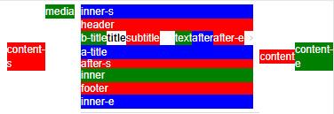

# 2018-09-18-F7的List组件图文示例

## list组件在移动端是非常常用的组件，官方文档里的相当slot比较多，在使用的过程中常发现不知道使用哪些slot和自己的PSD比较匹配，现列出展示代码和效果图，以备不时之需： 


```html

<f7-list media-list style="margin:0px;">
      <f7-list-item link="#" style="zoom:0.5">
        <!-- 3*content 3*after 3*inner 3*title media subtitle text header footer-->
        <div slot="content-start" style="background:red;color:white;">content-s</div>

        <div slot="media" style="background:green;color:white;">media</div>

        <div slot="inner-start" style="background:blue;color:white;">inner-s</div>
        <div slot="header" style="background:red;color:white;">header</div>
        <!-- 以下是一行 -->
        <div slot="before-title" style="background:green;color:white;">b-title</div>
        <div slot="title" style="background:red;color:white;">title</div>
        <div slot="subtitle" style="background:red;color:white;">subtitle</div>
        <div slot="text" style="background:red;color:white;">text</div>
        <div slot="after" style="background:blue;color:white;">after</div>
        <div slot="after-end" style="background:red;color:white;">after-e</div>
        <!-- 以上是一行 -->
        <div slot="after-title" style="background:blue;color:white;">a-title</div>
        <div slot="after-start" style="background:green;color:white;">after-s</div>
        <div slot="inner" style="background:green;color:white;">inner</div>
        <div slot="footer" style="background:red;color:white;">footer</div>
        <div slot="inner-end" style="background:blue;color:white;">inner-e</div>

        <div slot="content" style="background:red;color:white;">content</div>

        <div slot="content-end" style="background:green;color:white;">content-e</div>

      </f7-list-item>
</f7-list>

```


## 成果展示：

