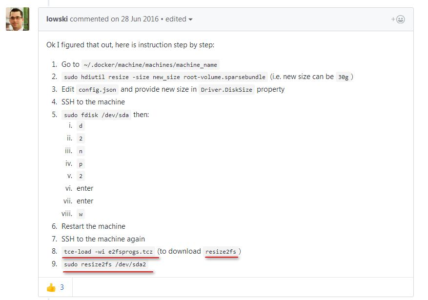

  <pre >
    Windows Docker Toolbox
  </pre>

##Windows Docker Toolbox在安装的时候并没有设置虚拟机大小的选项，造成后面应用越来越多的时候发现空间不足，于是着手增加虚拟机空间：

1. 修改现有虚拟磁盘大小

  
> VirtualBox修改现有虚拟磁盘大小 - CSDN博客  <https://blog.csdn.net/weiguang1017/article/details/52252448>

​	 1.1 转格式：目标文件最好和当前的一致，不一致如果移动vdi，加载vdi会报重复uuid错误；
	 1.2 调整大小:
	 1.3 把新生成的vdi文件加入virtualbox里面，重启

​	重启后硬盘空间并没有加大，需要在boot2docker里面调整大小

2. 调整linux分区大小

> Linux下使用fdisk扩展分区容量 | 《Linux就该这么学》  <https://www.linuxprobe.com/linux-fdisk-size.html>

2. 1 fdisk /dev/sda 

在boot2docker里面运行这个命令会有startchs endchs,而不是start end . 在google上也查不到为什么。

所以没法像上面一样比较磁盘柱，不管就直接enter了

2. 2 boot2docker 里面没有resize2fs命令，找了好久找不到原因;

Resize existing machine · Issue #123 · machine-drivers/docker-machine-driver-xhyve  <https://github.com/machine-drivers/docker-machine-driver-xhyve/issues/123>

在网上找了一下说boot2docker 因为是极简的linux里面没有resize2fs, 也无法apt-get , 但有个tce-load

可是tce-load又不能用root , 所有想到用docker-machine ssh登陆后使用tce-load;

3. 用tce-load安装resize2fs 调整空间大小

> docker之docker-machine用法 - wadeson - 博客园 <https://www.cnblogs.com/jsonhc/p/7784466.html>

3.1 tce-load -wi e2fsprogs.tcz (to download resize2fs)

3.2 sudo resize2fs /dev/sda1

3.3 Df -h

