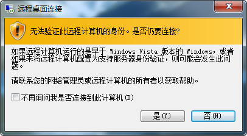

{{ page.title }}
================

# 安装ubuntu 18.4.0 并用windows7远程控制实操

##1  刚好有一个空闲电脑，想在上面装上ubuntu系统，为以后工作方便，可以从windows远程桌面控制，切换到ubuntu开发： 

> 参考实操：在已安装win10环境中利用EasyBCD引导安装Ubuntu16.04 适用于Ubuntu 18.04(DELL笔记本电脑测试通过) - CSDN博客  
>
> https://blog.csdn.net/stzx_01/article/details/80242757

在安装的过程中，手动分区时出现 问题，手动分好主分区/ , swap , /boot分区之后就分不下去了，剩下的空间从free space 突然变成unusable , 于是在网上搜索了一下：

> 小白装Ubuntu之问题记录与解决（win7下安装Ubuntu13.04） - CSDN博客  https://blog.csdn.net/sum_rain/article/details/38619387
>
> 安装中，手动分区时free space变成unusable？原因在于windows只支持四个主分区，而c,d,e,f盘已经占掉。解决方法一，/、/boot、swap、/home都以logical来分区。方法二，先将/boot、swap、/home用logical分区，最后用primary将/分区。


##2   ubuntu安装完全之后，就要尝试实现用windows的远程桌面控制ubuntu

> 参考实操：Connect To Ubuntu 16.04 / 17.10 / 18.04 Desktop Via Remote Desktop Connection (RDP) With Xrdp
>
> https://websiteforstudents.com/connect-to-ubuntu-16-04-17-10-18-04-desktop-via-remote-desktop-connection-rdp-with-xrdp/

以上参考实操是最终的参考，刚开始参考了好几个，用windows连接之后黑屏，屏幕内容出不来，尝试了很久，最终找到了这一个，于是又重作了系统，仔细地根据上面的步骤操作了一下，终于成功的，其实还是挺简单的。


##3  用windows远程桌面连接ubuntu之后发现dock没有出来，而且程序图标没有正确显示，于是又寻找解决文案，原来是系统主题和图标的问题：

> 参考实操：xRDP – How to Fix Theme issues in Ubuntu 18.04 remote session – Griffon's IT Library' 
>
> http://c-nergy.be/blog/?p=12155

```shell

gnome-shell-extension-tool -e ubuntu-dock@ubuntu.com
gnome-shell-extension-tool -e ubuntu-appindicators@ubuntu.com
gsettings set org.gnome.desktop.interface gtk-theme 'Ambiance'
gsettings set org.gnome.desktop.interface icon-theme 'Humanity'

```


##成果展示：


 


